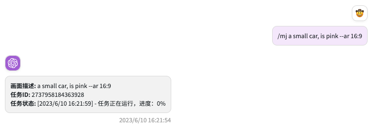

<div align="center">

<h1 align="center">ChatGPT-Midjourney</h1>

一键免费部署你的私人 ChatGPT+Midjourney 网页应用（基于[ChatGPT-Next-Web](https://github.com/Yidadaa/ChatGPT-Next-Web)开发）

[QQ交流群：849273126](http://qm.qq.com/cgi-bin/qm/qr?_wv=1027&k=gAGpNxOKdRB3L_IiHWAfT4MUQzgBOor-&authKey=Ty8WQgZFub8W1EsG3LQE2B3xxRRBzD0Rj1rPyRVFdT6IqnJgGcpPZB5l8ZVJTB1n&noverify=0&group_code=849273126) ｜ [问题反馈](https://github.com/Licoy/ChatGPT-Midjourney/issues)

[](https://vercel.com/new/clone?repository-url=https%3A%2F%2Fgithub.com%2FLicoy%2FChatGPT-Midjourney&env=OPENAI_API_KEY&env=MIDJOURNEY_PROXY_URL&env=CODE&project-name=chatgpt-midjourney&repository-name=ChatGPT-Midjourney)


</div>

## 功能支持
- [x] 原`ChatGPT-Next-Web`所有功能
- [x] midjourney `imagin` 想象
- [x] midjourney `upscale` 放大
- [x] midjourney `variation` 变幻
- [x] midjourney `describe` 识图
- [x] midjourney `blend` 混图
- [x] midjourney 垫图
- [x] 绘图进度百分比、实时图像显示

## 部署
### Midjourney-Proxy地址配置
- 环境变量中

在项目的根目录下的`.env`文件中的`MIDJOURNEY_PROXY_URL`填入你的midjourney服务地址，例如：
```
MIDJOURNEY_PROXY_URL=http://localhost:8080
```
> ⚠️注意：如果你使用的是Docker部署，那么这里的地址应该是`http://公网IP:port`，而不是`http://localhost:port`，因为Docker中的容器是隔离的，`localhost`指向的是容器内部的地址，而不是宿主机的地址。
- 界面中


- 其他方式

如下方的Docker等直接参考对应的部署方式。

### Docker部署
- 运行 `midjourney-proxy` (Midjourney API服务，更多参数配置可以参考：[midjourney-proxy](https://github.com/novicezk/midjourney-proxy))
```shell
docker run -d --name midjourney-proxy \
 -p 8080:8080 \
 -e mj.discord.guild-id=xxx \
 -e mj.discord.channel-id=xxx \
 -e mj.discord.user-token=xxx \
 -e mj.discord.bot-token=xxx \
 --restart=always \
 novicezk/midjourney-proxy:2.1.6
```
- 运行 `ChatGPT-Midjourney`
```shell
docker pull licoy/chatgpt-midjourney

docker run -d -p 3000:3000 \
   -e OPENAI_API_KEY="sk-xxx" \
   -e CODE="123456" \
   -e BASE_URL="https://api.openai.com" \
   -e MIDJOURNEY_PROXY_URL="http://ip:port" \
   licoy/chatgpt-midjourney
```
### 手动部署
- clone本项目到本地
- 安装依赖
```shell
npm install
npm run build
npm run start // #或者开发模式启动： npm run dev
```

## 使用
在输入框中以`/mj`开头输入您的绘画描述，即可进行创建绘画，例如：
```
/mj a dog
```
### 混图、识图、垫图

> 提示：垫图模式/识图(describe)模式只会使用第一张图片，混图(blend)模式会按顺序使用选中的两张图片（点击图片可以移除）

## 截图

### 混图、识图、垫图

### 支持中文+状态实时获取

### 自定义midjourney参数


## 鸣谢
- [ChatGPT-Next-Web](https://github.com/Yidadaa/ChatGPT-Next-Web)
- [midjourney-proxy](https://github.com/novicezk/midjourney-proxy)

## 开源协议
[Anti 996 LICENSE](./LICENSE)